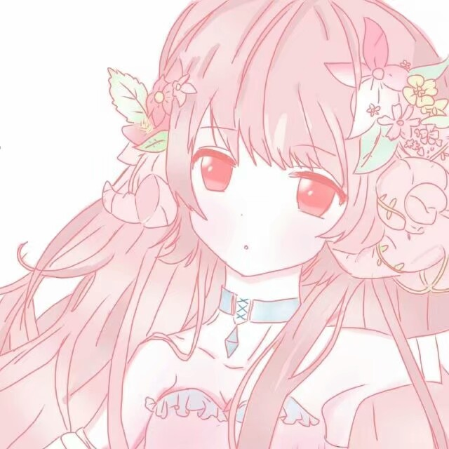

<!DOCTYPE html>
<html lang="zh-cn">
  <head>
	<meta charset="utf-8"/>
	<title>小小的世界</title>
	<link href="test.css"rel=“stylesheet” type="text/css"/>
</head>
<body>
<h1>欢迎来到俺滴世界</h1>

整了一大顿还不确定巴拉巴拉，，，

<h1>先整份小小的自我介绍</h1>

喜欢动漫，放张爱图(俺都换了十几张图，终于看到了，泪流满面）

喜欢小说，来个链接（正版阅读平台还不容易找，，，）

<a href="https://ubook.reader.qq.com/intro.html?bid=933335&amp;b_f=231004">俺很安全</a>

以前我以为看动漫是保有童心，相信童话，永远年轻，但现在是学会成长，或许无法像主角那样成功逆袭，但应该心怀憧憬，决不放弃

</body>
</html>
